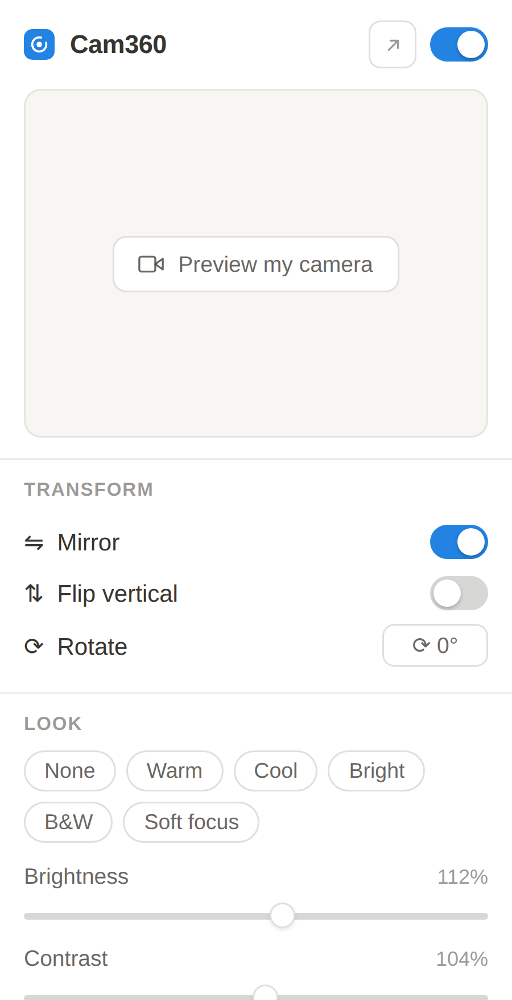

# Cam360

Virtual backgrounds and webcam effects for any video call in your browser.

[**Add to Chrome**](https://chromewebstore.google.com/detail/cam360/ddnijfcmkiogmndecegggdieokbhlhpe)
· [Website](https://fuckwebcam.xyz)
· [Report a bug](https://github.com/realanshuman/cam360/issues/new/choose)

Cam360 sits between your webcam and the website asking for it. Blur or replace
your background, fix bad lighting, and get your framing right, using the same
controls on every site rather than whatever each meeting app happens to offer.

Everything runs on your own machine. The extension makes no network requests,
has no account, and never uploads a frame.



## Install

**From the Chrome Web Store**, which is the easy path:
[Add Cam360 to Chrome](https://chromewebstore.google.com/detail/cam360/ddnijfcmkiogmndecegggdieokbhlhpe).

**From source**, if you would rather run the code in front of you:

1. Clone or download this repository.
2. Open `chrome://extensions` and turn on Developer mode, top right.
3. Choose Load unpacked and select the project folder, the one holding `manifest.json`.
4. Pin Cam360 to the toolbar.

Then open any site that uses your camera and click the icon. Changes apply to a
running camera straight away. If a site grabbed the camera before the extension
loaded, toggle your camera off and on once in that site.

## What you can do

- **Background.** Blur it, fill it with a colour, or replace it with an image or
  a looping video. You are cut out either by an AI model running on your device
  or by green screen keying.
- **Lighting.** Brightness, contrast, saturation and hue, a low light boost for
  dim rooms, six one click presets, and skin smoothing.
- **Framing.** Mirror, flip, rotate, and zoom up to 250 percent.
- **Stepping away.** Freeze the frame or show a be right back card, so the call
  still counts you as present. Save the current frame as a PNG.
- **Overlays.** A name tag, a logo watermark and a live clock, drawn into the
  outgoing video rather than added by the meeting app.
- **Mid call.** Press <kbd>Alt</kbd> <kbd>Shift</kbd> <kbd>C</kbd> for a
  draggable panel, so you can adjust without leaving the meeting.

The popup also has a live preview that runs the real pipeline, so what you see
there is what the call receives.

## What it cannot do

Worth knowing before you install.

- **Desktop apps are out of reach.** A browser extension only sees video inside
  the browser, so the Discord and Zoom desktop clients cannot be touched. That
  needs an operating system level virtual camera driver, which no extension can
  install. Use the web version of those apps, or pair Cam360 with
  [OBS Virtual Camera](https://obsproject.com/).
- **Google Meet blocks the AI background.** Meet sets a content security policy
  that stops extensions loading WebAssembly into its page, and the segmentation
  model needs it. Switch the cut out method to green screen and background
  replacement works there too. Every other effect is unaffected.
- **Chromium browsers only.** Chrome, Edge, Brave and Arc. Firefox and Safari
  use a different extension model.

## Privacy

No network requests, no telemetry, no analytics, no account. Your settings live
in `chrome.storage.local` on your machine, and the AI model ships inside the
extension instead of being downloaded. Full policy: [fuckwebcam.xyz/privacy](https://fuckwebcam.xyz/privacy).

---

# For developers

## How it works

When a page calls `navigator.mediaDevices.getUserMedia`, Cam360 answers first.
It takes the real camera track, draws every frame through an offscreen canvas
where the effects are applied, and hands back a `canvas.captureStream()` in its
place. Audio passes through untouched, and if anything fails it falls back to
the raw camera so a call never breaks.

Two content scripts, because they need different powers:

- `src/inject.js` runs in the **MAIN** world, since patching `getUserMedia`
  means living in the page's own JavaScript context.
- `src/bridge.js` runs in the **ISOLATED** world, because MAIN world scripts
  cannot read `chrome.storage`. It owns settings and forwards them across with
  `window.postMessage`, and it draws the in-call panel.

Both run at `document_start`, so the hook is installed before any site can ask
for the camera.

The frame pipeline lives in one file, `src/engine.js`, used by both the page
pipeline and the popup preview. That is deliberate. A preview drawn by a second
implementation would drift from the real output and stop being a preview.

## Project layout

```
manifest.json          MV3 manifest, content scripts in MAIN and ISOLATED worlds
src/engine.js          the shared frame pipeline: effects, keyers, overlays
src/inject.js          MAIN world, the getUserMedia override
src/bridge.js          ISOLATED world, storage bridge and the in-call panel
src/background.js      service worker, relays the keyboard shortcut
popup/                 toolbar popup, runs the engine for the live preview
vendor/mediapipe/      bundled selfie segmentation model and WASM
test/test.html         standalone page to check the pipeline without a call
web/                   the marketing site, static, no build step
brand/                 brand guide and logo source
docs/seo-plan.md       search and answer engine plan
scripts/package.sh     builds the Chrome Web Store zip
```

## Working on it

Load the extension unpacked as described above, then reload it from
`chrome://extensions` after each change. Content script changes also need the
target tab reloaded.

`test/test.html` exercises the pipeline without joining a real call. Opening it
over `file://` requires "Allow access to file URLs" on the Cam360 card in
`chrome://extensions`.

The popup is resizable. Drag the grip in its corner, within Chrome's 800x600
popup ceiling, or use the arrow in the header to open the same UI as a real
window. The layout switches to two panes past 560px and flows into more columns
as it grows.

## Building a release

```bash
./scripts/package.sh
```

This writes `dist/cam360-<version>.zip` with `manifest.json` at the zip root,
which is what the Chrome Web Store requires. Bump `version` in `manifest.json`
first.

## The website

`web/` is a single static page with no build step and no framework. Every
product image on it is a real screenshot rendered from this code, never a
mockup. `vercel.json` points Vercel at `web/` as the output directory, so a
static deploy needs no dashboard configuration.

If you move it to a different domain, update the absolute URLs in
`web/index.html` (canonical, `og:url`, `og:image`, `twitter:image`, and the
JSON-LD block), `web/privacy.html`, `web/sitemap.xml` and `web/robots.txt`.

## Support

Questions, bugs and ideas all go to
[GitHub issues](https://github.com/realanshuman/cam360/issues/new/choose).
There is no support inbox, so asking here keeps the answer public for whoever
hits the same thing next. Include the site you were on, your browser version,
and the Cam360 version from `chrome://extensions`.

## License

Not yet chosen. Until a license file is added, default copyright applies and
nobody else has permission to reuse this code.
