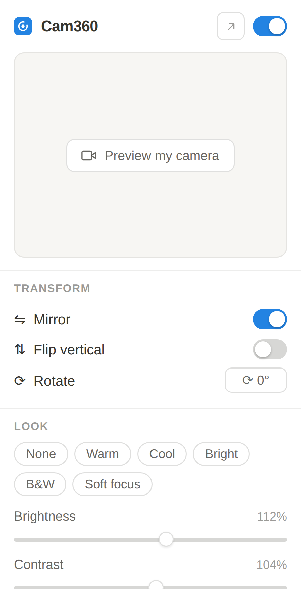

# Cam360

Virtual backgrounds and webcam effects for any video call in your browser.

[**Add to Chrome**](https://chromewebstore.google.com/detail/cam360/ddnijfcmkiogmndecegggdieokbhlhpe)
· [Website](https://fuckwebcam.xyz)
· [Support](https://github.com/realanshuman/cam360-support)

Cam360 sits between your webcam and the website asking for it. Blur or replace
your background, fix bad lighting, and get your framing right, using the same
controls on every site rather than whatever each meeting app happens to offer.

Everything runs on your own machine. The extension makes no network requests,
has no account, and never uploads a frame.



## Install

[Add Cam360 to Chrome](https://chromewebstore.google.com/detail/cam360/ddnijfcmkiogmndecegggdieokbhlhpe)
from the Chrome Web Store, which is the only place it is distributed.

Then open any site that uses your camera and click the icon. Changes apply to a
running camera straight away. If a site grabbed the camera before the extension
loaded, toggle your camera off and on once in that site.

## What you can do

- **Background.** Blur it, fill it with a colour, or replace it with an image or
  a looping video. You are cut out either by an AI model running on your device
  or by green screen keying.
- **Lighting.** Brightness, contrast, saturation and hue, a low light boost for
  dim rooms, and six one click presets.
- **Skin smoothing.** Softens skin while your eyes, brows, lips and hair stay
  sharp, and leaves the room behind you alone. It finds you with the same AI
  cut-out the backgrounds use.
- **Framing.** Mirror, flip, rotate, and zoom up to 250 percent.
- **Stepping away.** Freeze the frame or show a be right back card, so the call
  still counts you as present. Save the current frame as a PNG.
- **Overlays.** A name tag, a logo watermark and a live clock, drawn into the
  outgoing video rather than added by the meeting app. Each one sits in
  whichever corner you pick.
- **Mid call.** Press <kbd>Alt</kbd> <kbd>C</kbd> for a draggable panel, so you
  can adjust without leaving the meeting. The popup shows the shortcut actually
  bound on your machine, and clicking it opens Chrome's shortcuts page if you
  want a different one.

The popup also has a live preview that runs the real pipeline, so what you see
there is what the call receives.

The popup, the in-call panel and the words on the be right back card follow
your browser's language: English, Spanish, Portuguese (Brazil), French, German
or Japanese.

## What it cannot do

Worth knowing before you install.

- **Desktop apps are out of reach.** A browser extension only sees video inside
  the browser, so the Discord and Zoom desktop clients cannot be touched. That
  needs an operating system level virtual camera driver, which no extension can
  install. Use the web version of those apps, or pair Cam360 with
  [OBS Virtual Camera](https://obsproject.com/).
- **Google Meet blocks the AI background.** Meet sets a content security policy
  that stops extensions loading WebAssembly into its page, and the segmentation
  model needs it. Switch the cut out method to green screen and background
  replacement works there too. Every other effect is unaffected.
- **Chrome, Edge, Brave, Arc and Firefox.** Firefox needs version 140 or
  later, and its build is not on addons.mozilla.org yet (see Building a
  release). Safari uses a different extension model.

## Privacy

No network requests, no telemetry, no analytics, no account. Your settings live
in `chrome.storage.local` on your machine, and the AI model ships inside the
extension instead of being downloaded. Full policy: [fuckwebcam.xyz/privacy](https://fuckwebcam.xyz/privacy).

---

# For developers

## How it works

When a page calls `navigator.mediaDevices.getUserMedia`, Cam360 answers first.
It takes the real camera track, draws every frame through an offscreen canvas
where the effects are applied, and hands back a `canvas.captureStream()` in its
place. Audio passes through untouched, and if anything fails it falls back to
the raw camera so a call never breaks.

Two content scripts, because they need different powers:

- `src/inject.js` runs in the **MAIN** world, since patching `getUserMedia`
  means living in the page's own JavaScript context.
- `src/bridge.js` runs in the **ISOLATED** world, because MAIN world scripts
  cannot read `chrome.storage`. It owns settings and forwards them across with
  `window.postMessage`, and it draws the in-call panel.

Both run at `document_start`, so the hook is installed before any site can ask
for the camera.

`src/settings.js` holds the shape of a settings object, so the engine, the
bridge and the popup cannot drift apart. Chrome injects a content script file
once per document even when two entries name it for different worlds, so it
loads in the ISOLATED world and in the popup, and the bridge hands the shape
to the MAIN world in the same message that carries the extension's base URL.

Uploaded backgrounds, cards and logos are data URLs, which can run to several
megabytes. They live under their own storage key, because every settings write
is broadcast to every frame of every open tab and cloned again on its way into
the page.

The frame pipeline lives in one file, `src/engine.js`, used by both the page
pipeline and the popup preview. That is deliberate. A preview drawn by a second
implementation would drift from the real output and stop being a preview.

## Project layout

```
manifest.json          MV3 manifest, content scripts in MAIN and ISOLATED worlds
_locales/              every word the extension shows, one folder per language
src/settings.js        the settings shape, and the settings/media storage split
src/engine.js          the shared frame pipeline: effects, keyers, overlays
src/inject.js          MAIN world, the getUserMedia override
src/bridge.js          ISOLATED world, storage bridge and the in-call panel
src/background.js      service worker, relays the keyboard shortcut
popup/                 toolbar popup, runs the engine for the live preview
popup/i18n.js          fills the popup and the permission tab from _locales
vendor/mediapipe/      bundled selfie segmentation model and WASM
test/test.html         standalone page to check the pipeline without a call
web/                   the marketing site, static, no build step
brand/                 brand guide and logo source
docs/seo-plan.md       search and answer engine plan
scripts/package.sh     builds the Chrome Web Store and Firefox zips
scripts/firefox-manifest.py  the Firefox manifest, made from manifest.json
```

## Working on it

Load the extension unpacked: open `chrome://extensions`, turn on Developer
mode, choose Load unpacked, and select the project folder, the one holding
`manifest.json`. Reload it from there after each change. Content script
changes also need the target tab reloaded.

`test/test.html` exercises the pipeline without joining a real call. Opening it
over `file://` requires "Allow access to file URLs" on the Cam360 card in
`chrome://extensions`.

The popup is resizable. Drag the grip in its corner, within Chrome's 800x600
popup ceiling, or use the arrow in the header to open the same UI as a real
window. The layout switches to two panes past 560px and flows into more columns
as it grows.

## Translations

Every word the extension shows comes from `_locales/<language>/messages.json`,
through the browser's i18n API, and the browser picks the language. English
is the source and the fallback, and its entries carry a description for
translators.

- The popup and the permission tab mark their text with `data-i18n` (and
  `data-i18n-title`, `data-i18n-aria-label`, `data-i18n-placeholder`), and
  `popup/i18n.js` fills it in. The English stays in the markup, so a missing
  message shows English, never a blank.
- `src/bridge.js` builds the in-call panel and reads its words directly.
- `src/engine.js` runs in the page's MAIN world, where the extension's
  messages cannot be read. It reports the AI model's state as a code, and the
  popup and the panel put it into words. The one text it draws, the be right
  back card, arrives already translated inside the settings.

To add a language, copy `_locales/en/messages.json` to `_locales/<code>/`,
translate every `message`, keep each `$PLACEHOLDER$` as it is, and keep
`extDescription` within 132 characters, the store's limit for the summary it
reads from there. The store listing text for each language is in
`brand/store/listing/`.

## Building a release

```bash
./scripts/package.sh
```

This writes `dist/cam360-<version>.zip` for the Chrome Web Store (Edge Add-ons
takes the same file) and `dist/cam360-firefox-<version>.zip` for
addons.mozilla.org, each with `manifest.json` at the zip root, which is what
both stores require. Bump `version` in `manifest.json` first.

Firefox runs the same code with a rewritten manifest, made by
`scripts/firefox-manifest.py`: an event page in place of the service worker,
the add-on ID, Firefox 140 as the minimum, and the declaration that Cam360
collects no data. The unpacked build is left in `dist/firefox/`. To try it,
open `about:debugging`, This Firefox, Load Temporary Add-on, and pick
`dist/firefox/manifest.json`, or run `npx web-ext run --source-dir
dist/firefox`. `npx web-ext lint --source-dir dist/firefox` reports no errors
and two expected warnings: the dynamic import that loads the bundled AI model
from inside the package, and a Firefox for Android version note for a
platform the build does not target. For the add-on review, the files in
`vendor/mediapipe/` are Google's unmodified release, as its README says.

## The website

`web/` is a single static page with no build step and no framework. The hero
is a camera preview with the effects as buttons under it, so the page shows
what Cam360 does before it says it. Every call on the page is drawn in markup,
never photographed, and its name tag, clock and be right back card copy what
`src/engine.js` draws. `vercel.json` points Vercel at `web/` as the output
directory, so a static deploy needs no dashboard configuration.

The layout is written phone first. Phones and tablets cannot install a Chrome
extension, so on a touch screen every "Add to Chrome" becomes "Send to my
computer": `web/site.js` opens the share sheet, copies the link where there is
none, and without script the button is a prefilled email.

The FAQ answers exist twice in `web/index.html`: on the page, and in the
`FAQPage` JSON-LD in the `<head>`. Change them together, word for word.

If you move it to a different domain, update the absolute URLs in
`web/index.html` (canonical, `og:url`, `og:image`, `twitter:image`, and the
JSON-LD block), `web/privacy.html`, `web/sitemap.xml` and `web/robots.txt`.

## Support

People get help in two places, both offered in the site's support section:

- [realanshuman/cam360-support](https://github.com/realanshuman/cam360-support),
  a public repository with no code in it. It holds the issue templates, and
  answers there stay public for whoever hits the same thing next.
- [hi@realanshuman.com](mailto:hi@realanshuman.com), for anyone without a
  GitHub account or who would rather ask privately.

The popup's Get help link and the store listing's Support URL point at
`fuckwebcam.xyz/#support` rather than at either channel, so the channels can
change without shipping a new version of the extension.

## License

Proprietary, all rights reserved. See [LICENSE](LICENSE).

The code was MIT licensed up to and including version 1.2.0, and copies taken
under those terms keep them.

The bundled MediaPipe selfie segmentation model and WASM runtime in
`vendor/mediapipe/` are Google's, under the Apache License 2.0, and are
redistributed here unchanged.
